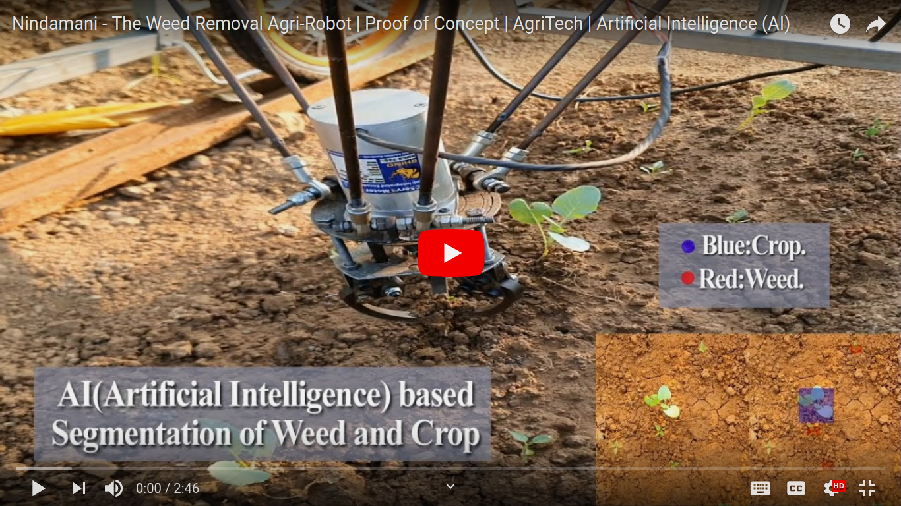

# Nindamani the weed removal robot

Nindamani, the AI based mechanically weed removal robot, which autonomously detects and segment the weeds from crop using artificial intelligence. The whole robot modules natively build on ROS2. Nindamani can be used in any early stage of crops for autonomous weeding.

  

In this following repository, you will find instructions for software installation and control mechanism for Nindamani robot.

# Features:
  - Fully ROS2 compatible
  - Battery Operated
  - Runtime upto 8-10 hours
  - Robotics Arm based weed removal
  - Weed detection accuracy upto 85%
  - Easy to Operate
 
# Software Specifications:

| Parameter | Value |
| ------------- | ------------- |
| Robotics OS | ROS2.0 Dashing Diademata |
| System | Ubuntu 18.04 LTS |
| Communication | Wireless , UART(internal motor control)  |
| AI Framework | Keras |
| Programming Language | Python3 & C |


# Hardware Specifications:

| Parameter | Value |
| ------------- | ------------- |
| Degrees of freedom | 3 DOF |
| Error  | ±2 mm |
| Payload | 1.5 kg |
| Weight | 35 kg |
| Height | 740 to 860 mm |
| Width | 980 mm |
| Arm Reach | 200x200 sq mm |
| Processor board | Jetson nano Dev Kit |
| Microcontroller | Arduino Mega |
| Servo Motor | 12V DC, 200RPM, 32kgcm H.Torque |
| Stepper Motor |  48V, 6A, Nema 34, 87 kgcm H.Torque|
| Camera | RPi cam ver.2 |
| Wifi card | Intel 8265 |
| USB-TTL cable |  PL2303HX chip |
| Battery | 48V 30ah |

# Packages
In this section we will install all the necessary dependencies in order to be able to launch nindamani robot:
  - `nindamani_agri_robot` - integrate all launch node of nindamani robot
  - `rpicam_ai_interface` - controlling the rpi camera with AI interface
  - `servo_control` -  controlling the servo motors with ROS2 interface
  - `stepper_control` - controlling the multiple stepper motors with ROS2 interface


# Installation on Jetson Nano Dev Kit

## 1. NVIDIA Jetpack SDK
  - Download latest SDK image: https://developer.nvidia.com/embedded/jetpack
  - Completely Format SD card (should not contain any partition). Use Ubuntu default app **Disks** [Recommeded 64GB SD card]
  - Copy ZIP(jetpack image) file to SD card: https://developer.nvidia.com/embedded/learn/get-started-jetson-nano-devkit#write
## 2. Prerequisites and Dependencies for TensorFlow
  - Install Keras: `sudo pip3 install keras`
  - Follow this instructions [official from NVIDIA]: https://docs.nvidia.com/deeplearning/frameworks/install-tf-jetson-platform/index.html#prereqs
## 3. ROS2 (Dashing Diademata)
  - Install ROS2 base: https://index.ros.org/doc/ros2/Installation/Dashing/Linux-Install-Debians/
  - Make sure that you have colcon in your machine if you are installing from Debian packages. `sudo apt install python3-colcon-common-extensions`
  - For adding additional packages use: `sudo apt install ros-$ROS_DISTRO-<package-name>`
  
## 4. Arduino
  - Follow this repo to install Arduino on Jetson nano: https://github.com/JetsonHacksNano/installArduinoIDE.git
  - To get Temporary access to USB: `sudo chown <user-name> /dev/tty<usb>` and `sudo chmod a+rw /dev/tty<usb>`
  - To set Permenantly change USB device permission: http://ask.xmodulo.com/change-usb-device-permission-linux.html
  - To control arduino from Command line Source:https://github.com/arduino/arduino-cli
  - Clone this repo: `https://github.com/AutoRoboCulture/Arduino-Jetson-nano-interface.git`
  - Place this repo in Arduino Folder

## 5. OpenCV 3.4.4
  - Refer link: https://www.pyimagesearch.com/2018/05/28/ubuntu-18-04-how-to-install-opencv/
  
## 6. Wifi
  - To setup default wifi connection(Intel 8265 NGW card) while bootup Source: https://desertbot.io/blog/how-to-add-a-dual-wifi-bluetooth-card-to-a-jetson-nano-intel-8265

# Create ROS2 Workspace
  - follow this steps:
  ```
    mkdir -p ~/nindamani_ws/src
    cd ~/ros2_mara_ws
    colcon build
    cd src
    git clone https://github.com/AutoRoboCulture/nindamani-the-weed-removal-robot.git
  ```

# Clone the Mask R-CNN GitHub Repository:
  1. Code: `git clone https://github.com/matterport/Mask_RCNN.git`
  2. Copy this cloned repo to `rpicam_ai_interface` package: `cp Mask_RCNN rpicam_ai_interface/.`
  3. Run command: 
      - `cd rpicam_ai_interface/Mask_RCNN`
      - `sudo python3 install setup.py`
  4. Confirm the Library Was Installed: `pip3 show mask-rcnn`


# Download preTrained Model weights 
  - Link for MASK-RCNN [preTrained model](https://drive.google.com/open?id=1bXEOmOsoBLpXQWVvhhJvhD-RjvCLxOAQ)
  - Copy preTrained weights to `rpicam_ai_interface` package: 
      ```
      mkdir rpicam_ai_interface/preTrained_weights
      cp mask_rcnn_trained_weed_model.h5 rpicam_ai_interface/preTrained_weights/.
      ```

# Follow Folder Structure:
  ```
  nindamani_ws
├── build
├── install
├── log
└── src
    ├── nindamani_agri_robot
    │   ├── launch
    │   └── scripts
    ├── rpicam_ai_interface
    │   ├── scripts
    │   ├── preTrained_weights
    │   └── Mask-RCNN
    ├── servo_control
    │   ├── config
    │   ├── scripts
    │   └── srv
    └── stepper_control
        ├── config
        ├── scripts
        ├── src
        └── srv
  ```
  
# Compile nindamani_ws
  - Follow steps:
    ```
    cd nindamani_ws
    colcon build
    ```
 # Dependency
 
 [Stepper Motor library implementation on Arduino](https://github.com/AutoRoboCulture/Arduino-Jetson-nano-stepper-motor-interface.git)
 
 # Launch nindamani robot
  - Make sure source *setup.bash* in *bashrc* before ROS2 launch command: `echo "source /home/<user-name>/nindamani_ws/install/setup.bash" >> ~/.bashrc`
  - ROS2 Launch command: `ros2 launch nindamani_agri_robot nindamani_agri_robot.launch.py`

# Demo video | Proof of Concept

[](https://www.youtube.com/watch?v=dN5NNDlvku0)

# Potential Improvements

We have presented the concept that how weeds can be detected from crops using Artifical Intelligence and through delta arm robot weeds are removed autonomously. It's not perfect of course as you can see in the **video link** but can be improved. Here are some of our ideas which can improvise this robot in future:

- Gripper design enchancement with end tip as arrow shaped.
- Delta arm reach can be improved with high torque stepper motor. 
- With RTK-GPS and 4 wheeled drive + 4 wheel steering implementation on robot, it will make whole robot working autonomously.
- Need 3D mapping of land using Lidar, for finding variations in height of crops, weeds and ridge.

# References
1. [Mask R-CNN for Object Detection and Segmentation](https://github.com/matterport/Mask_RCNN/)
```
 @misc{matterport_maskrcnn_2017,
  title={Mask R-CNN for object detection and instance segmentation on Keras and TensorFlow},
  author={Waleed Abdulla},
  year={2017},
  publisher={Github},
  journal={GitHub repository},
  howpublished={\url{https://github.com/matterport/Mask_RCNN}},
}
```
2. [Train Mask-RCNN model on Custom Dataset for Multiple Objects](https://github.com/AutoRoboCulture/mask-rcnn-for-multiple-objects.git)

3. [Delta Robot Simulation on Gazebo using MARA-Env](https://github.com/AutoRoboCulture/delta-robot-simulation-gazebo.git)


# Developer's Contact Detail
```
Kevin Patel
Nihar Chaniyara
Email: autoroboculture@gmail.com
```
